# High Dynamic Range Imaging

## Synopsis

This assignment focuses on the core algorithms behind computing HDR images based on the paper ["Recovering High
 Dynamic Range Radiance Maps from Photographs” by Debevec & Malik](https://www.pauldebevec.com/Research/HDR/). I implemented the HDR algorithms from the paper and used [contrast limited adaptive histogram equalization (CLAHE)](https://en.wikipedia.org/wiki/Adaptive_histogram_equalization) to improve the basic HDR image

## Results

### Result of sample image set

Input stack of images:

1 | 2 | 3
|:---:|:---:|:---:|
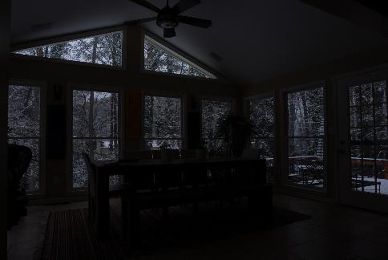 | 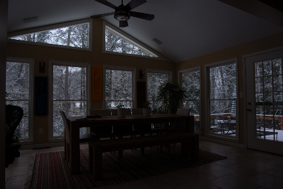 | 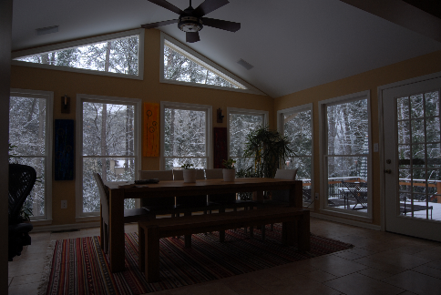
 4 | 5 | 6
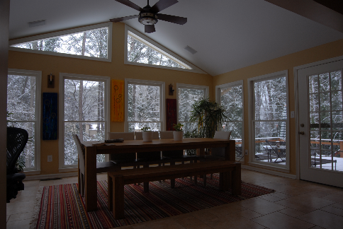 | 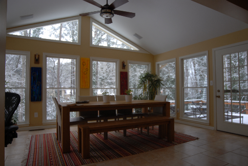 | 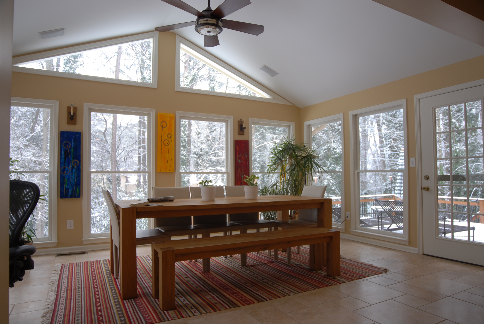

Radiance map of BGR channels:

Blue channel | Green channel | Red channel
|---|---|---|
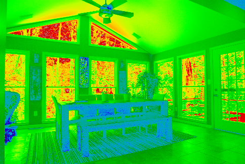 | 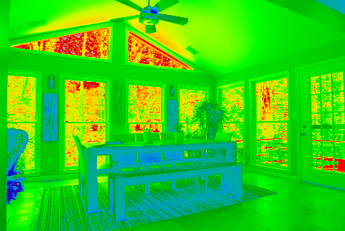 | 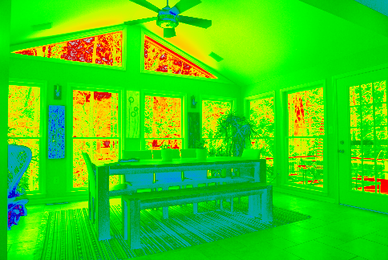

- The red and bright area represent the high light intensity 
- The blue and deep area represents the low light intensity

Basic HDR image:

basic HDR | histogram
|---|---|
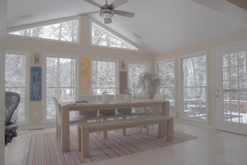 | 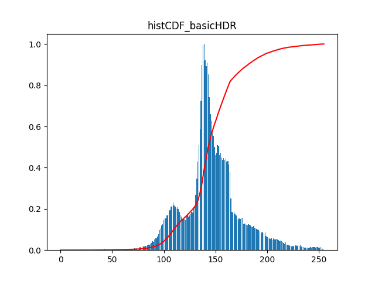

- Produced by min-max normalization of radiance values in each color channel
- The blue bar represents the number of pixels with that brightness value
- The red line represents the cumulative density of pixels

Histogram equalized picture | histogram
|---|---|
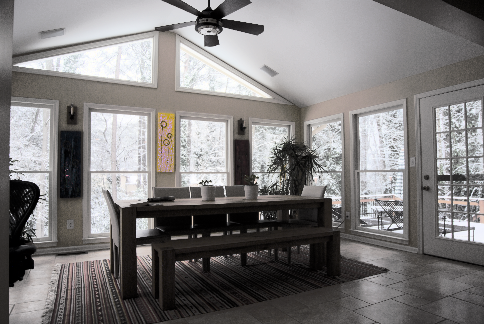 | 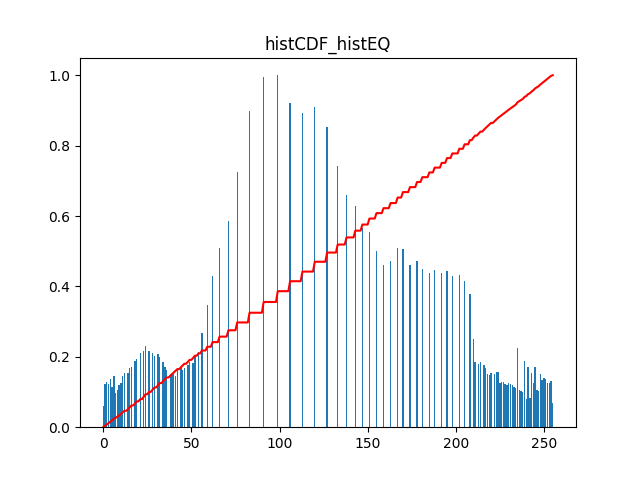

- Produced by applying histogram equalization
- The contrast in increased after histogram equalization. However, it introduced too much contrast in the whole image.

After improvement with CLAHE, the best HDR picture | histogram
|---|---|
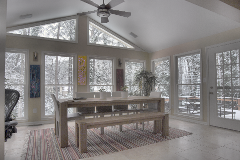 | 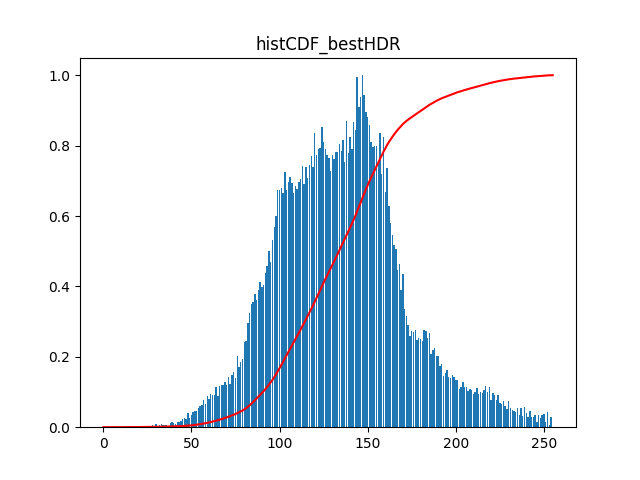

- I used [contrast limited adaptive histogram equalization (CLAHE)](https://en.wikipedia.org/wiki/Adaptive_histogram_equalization) to improve the basic HDR image.
- Each distinct section of the image get improved by histogram equalization

### Result of another image set

Input stack of images from [HDR Pics to play with: High Five](https://farbspiel-photo.com/learn/hdr-pics-to-play-with/high-five-ppw):

Parameters:

Img | Exposure | Aperture | ISO
|---|---|---|---|
01 | 1/8 | f5.6 | 400
02 | 1/15 | f5.6 | 400 
03 | 1/30 | f5.6 | 400
04 | 1/60 | f5.6 | 400
05 | 1/125 | f5.6 | 400
06 | 1/250 | f5.6 | 400
07 | 1/500 | f5.6 | 400

1 | 2 | 3
|:---:|:---:|:---:|
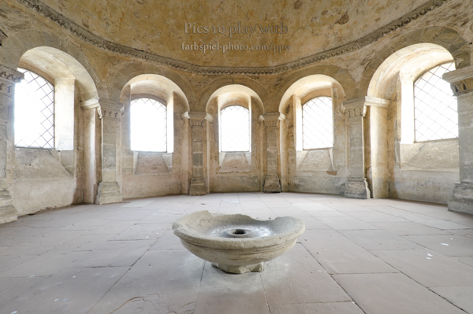 | 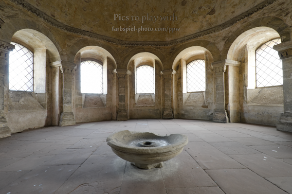 | 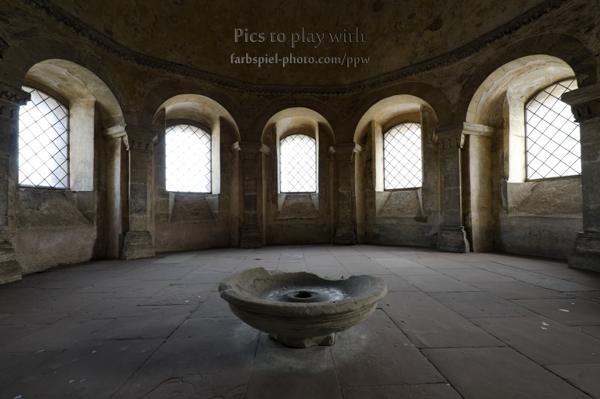
 4 | 5 | 6
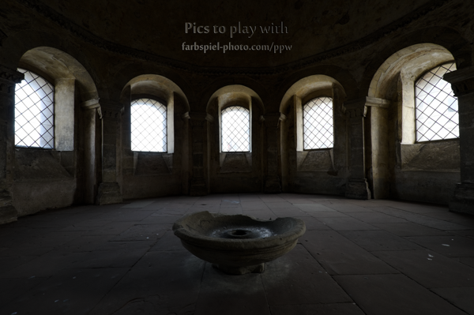 | 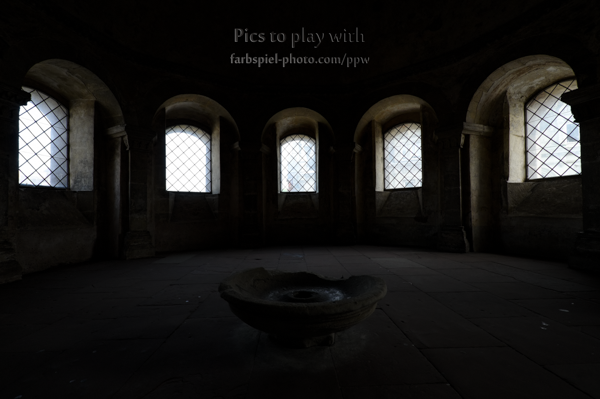 | 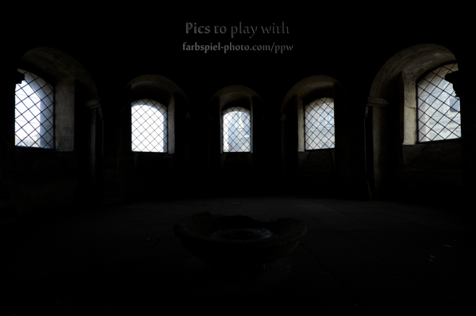
 7 | 8
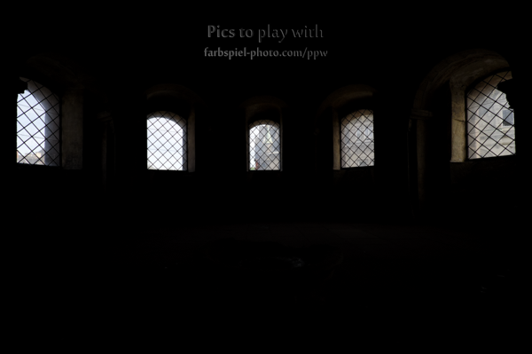 | 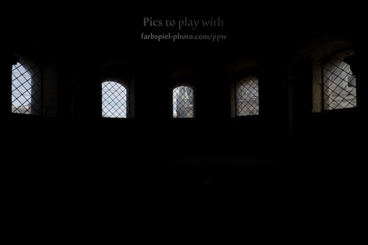

Radiance map of BGR channels:

Blue channel | Green channel | Red channel
|---|---|---|
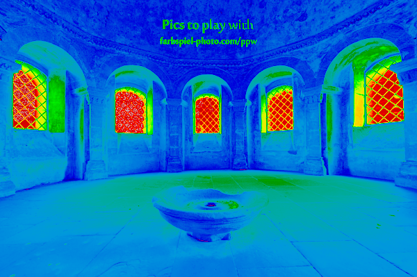 | 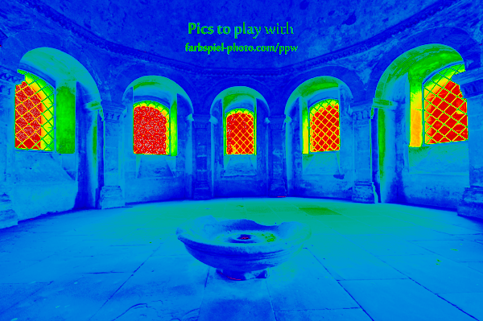 | 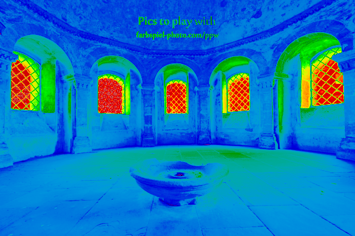

Basic HDR image:

basic HDR | histogram
|---|---|
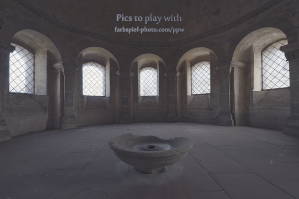 | 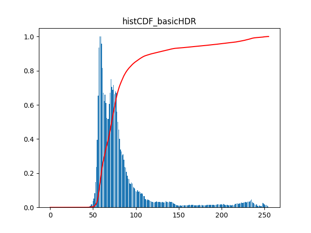

Histogram equalized picture | histogram
|---|---|
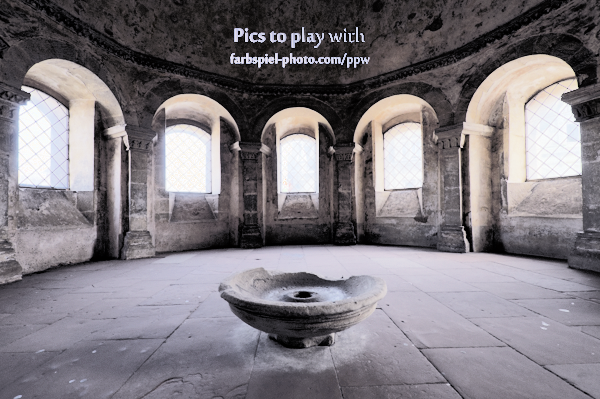 | 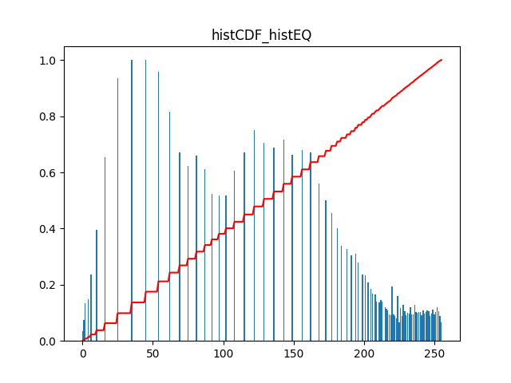

After improvement with CLAHE, the best HDR picture | histogram
|---|---|
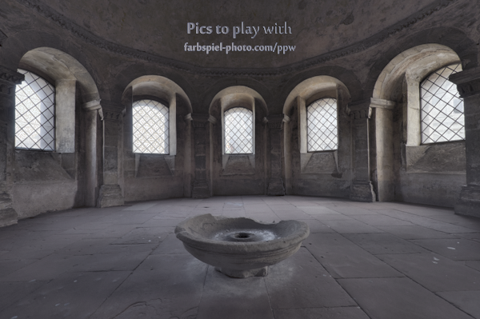 | 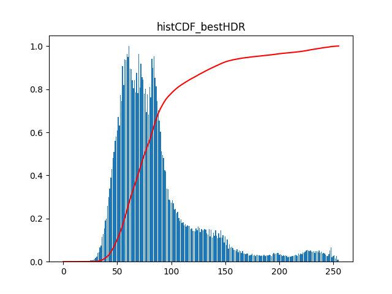

