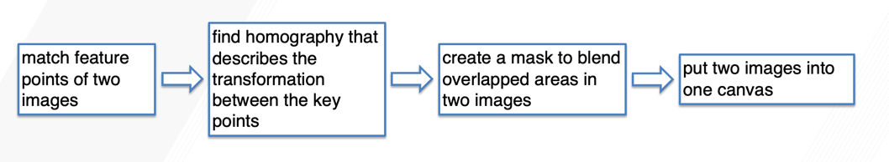
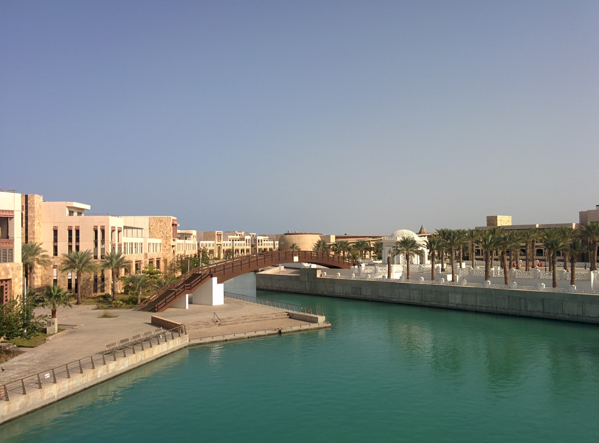
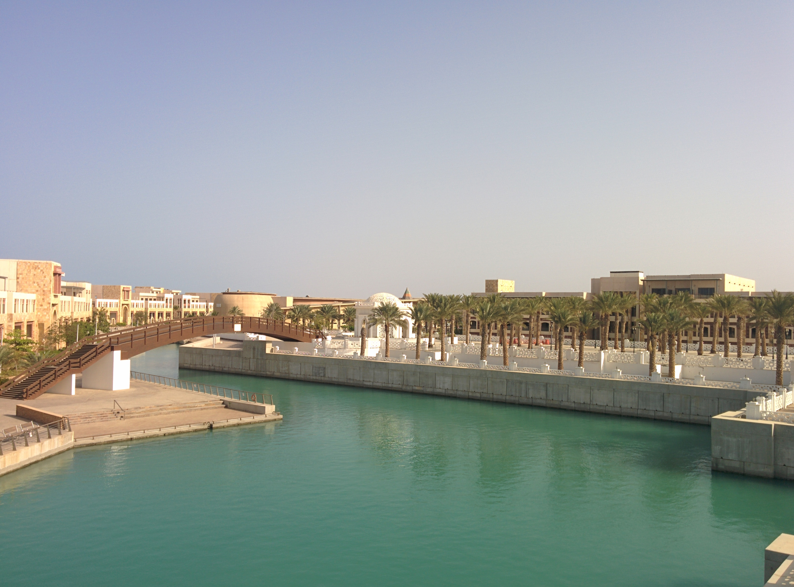
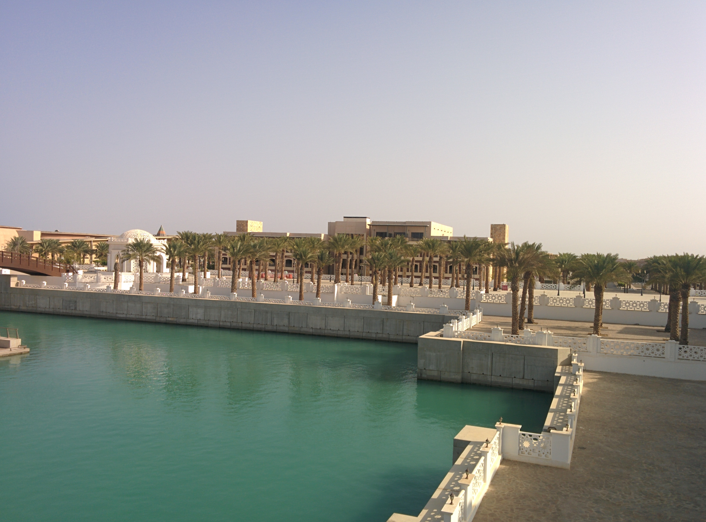
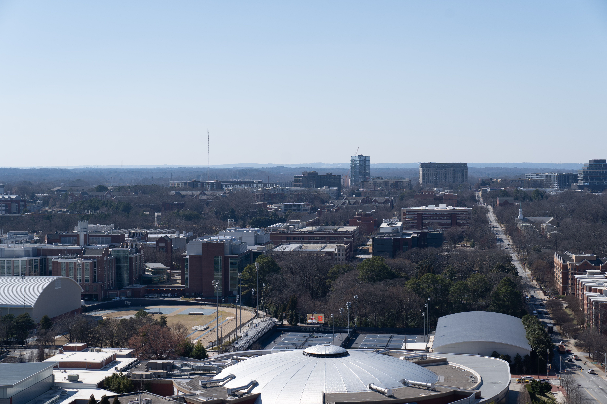
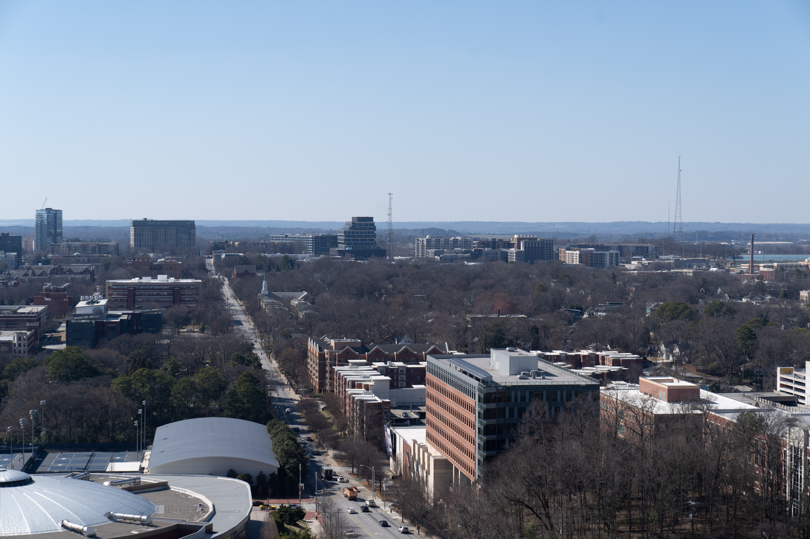
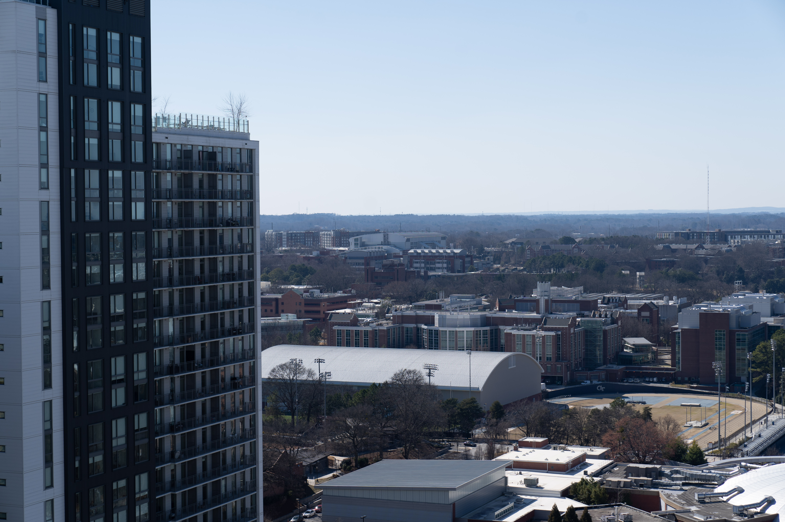

# Panoramas

## Synopsis

In this assignment, I implemented a pipeline to align and stitch together a series of images into a panorama. I used my code on my own pictures to make a panorama.

The pipeline looks like this:

## Results

### Blend result of sample images

Input images:

image 1 | image 2 | image 3
|---|---|---|
 |  | 

Result:

### Blend result of my own images

Input images:

image 1 | image 2 | image 3
|---|---|---|
 |  | 

Interim result:

After getting the homography, I apply the transformation to the image. Also, create a new canvas that is large enough to include two input images.

I use distance map to generate a mask and use this mask to blend two images together.
In the overlap area, pixels closer to the left image will have more weight from the left image. Pixels closer to the right image will have more weight from the right image.

Result:

The blending result of my input images looks good. My input images are very easy to blend. They have clear features between images to be detected by algorithm. They also have same exposure values and that makes the overlapping area almost invisible. 
