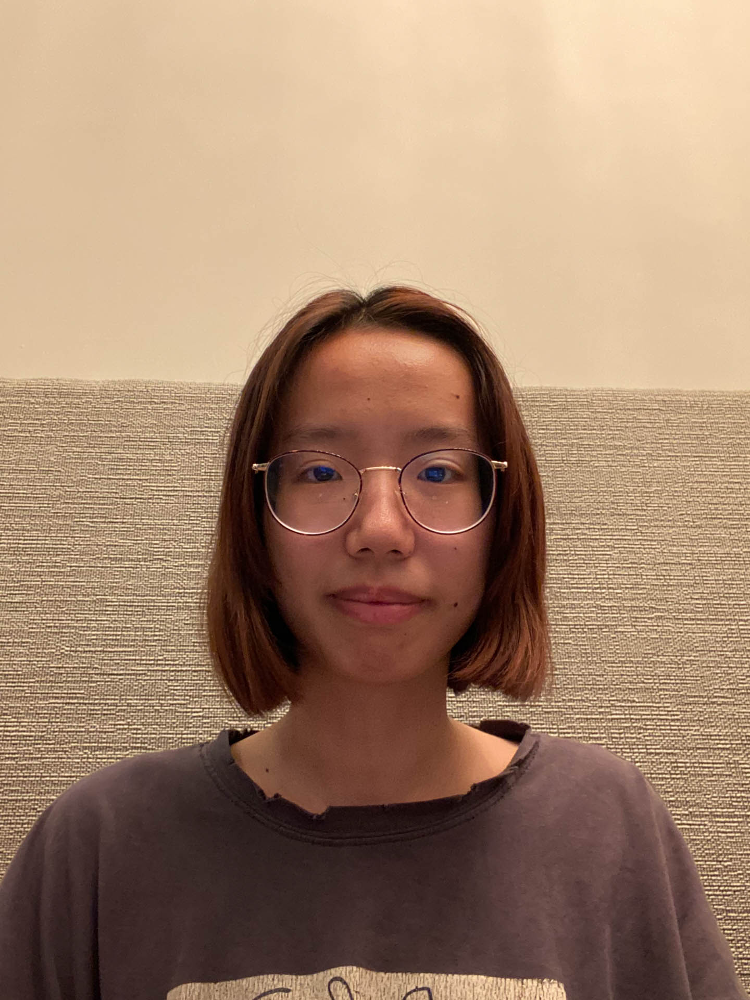
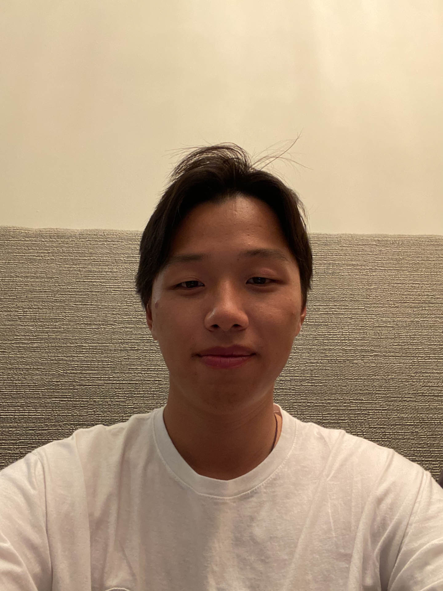

# Pyramid Blending

## Synopsis
In this assignment, I put together a pyramid blending pipeline that will combine separate images into a seamlessly blended image.

Reference papers:
  - [“The Laplacian Pyramid as a Compact Image Code"](http://persci.mit.edu/pub_pdfs/pyramid83.pdf) (Burt and Adelson; 1983)
  - [“A Multiresolution Spline With Application to Image Mosaics”](http://persci.mit.edu/pub_pdfs/spline83.pdf) (Burt and Adelson; 1983)

## Results

### Blend input of image set 1:

black image | mask | white image
|----|----|----|
 |  | 

Interim result:

Gauss pyramid of black image | Gauss pyramid of mask image | Gauss pyramid of white image
|----|----|----|
 |  | 

Laplacian pyramid of black image | Laplacian pyramid of white image | Output pyramid
|----|----|----|
 |  | 

Blend result:

### Blend input of image set 2:

black image | mask | white image
|----|----|----|
 |  | 

Interim result:

Gauss pyramid of black image | Gauss pyramid of mask image | Gauss pyramid of white image
|----|----|----|
 |  | 

Laplacian pyramid of black image | Laplacian pyramid of white image | Output pyramid
|----|----|----|
 |  | 

Blend result:

The  blend  allowed  me to smoothly combine two images even with an unprecise mask that has a sharp edge on the blending position. The algorithm will take information from both sides and blend them well.
