# Seam Carving

## Synopsis

The goal of this project is to replicate the results of published 
Computational Photography papers by following the methods described in the 
papers:

- Shai Avidan, Ariel Shamir. [Seam Carving for Content-Aware Image Resizing](http://www.faculty.idc.ac.il/arik/SCWeb/imret/index.html). (2007)
- Micheal Rubinstein, Ariel Shamir, Shai Avidan. [Improved Seam Carving for 
  Video Retargeting](http://www.faculty.idc.ac.il/arik/SCWeb/vidret/index.html). (2008)   **You are using methods from this paper for static images, 
  not video.**

Specifically, I implemented seam removal and insertion with both backward and forward energy methods.

## Results

### Results of beach image

#### Seam removal of 50% of seams with backward energy

Input image | my result | result in paper
|---|---|---|
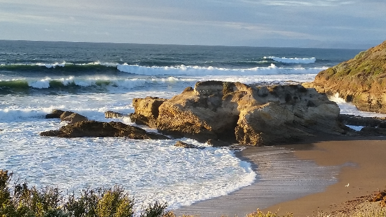 | 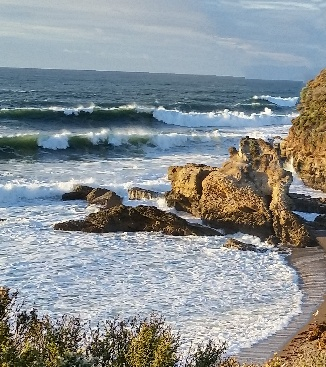 | 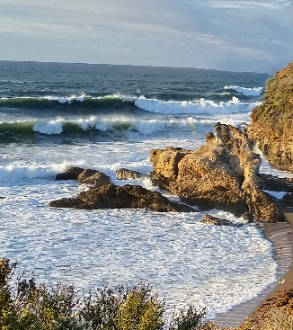

### Results of bench image

#### Seam removal of 50% of seams with backward energy

Input image | my result | result in paper
|---|---|---|
 | 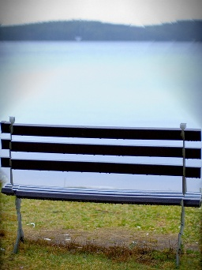 | 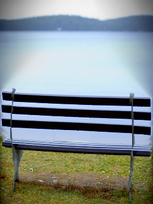
| showing the seams removed on base image: | 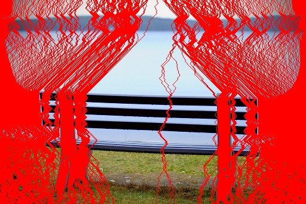 | 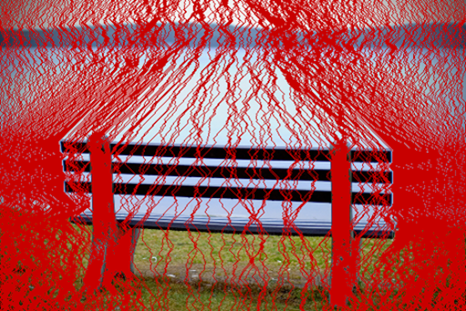

#### Seam removal of 50% of seams with forward energy

Input image | my result | result in paper
|---|---|---|
 | 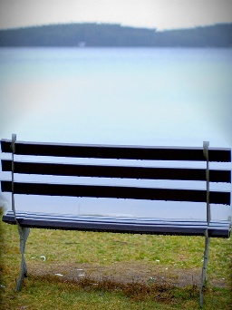 | 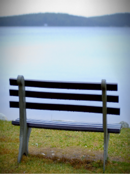
| showing the seams removed on base image: | 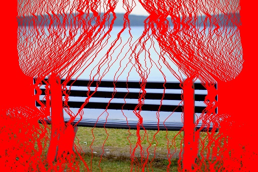 | 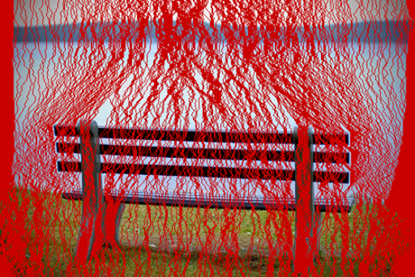

- The algorithm will remove a connected seam from top to bottom that this removal will not affect much on the content in the image

### Result of dolphin image

#### Backwards seam insertion of 50% of seams

Input image | my result | result in paper
|---|---|---|
 |  | 
| showing the seams removed on base image: | 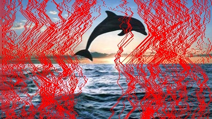 | 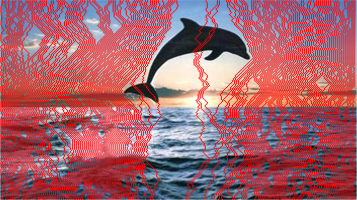

#### Backwards seam insertion of additional 50% of seams

Input image | my result | result in paper
|---|---|---|
 |  | 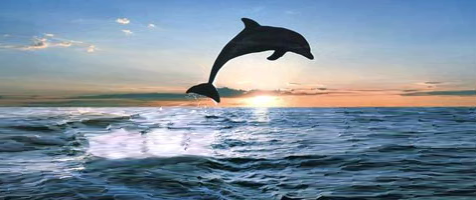

- The algorithm will insert a connected seam from top to bottom that this insertion will not affect much on the content in the image
