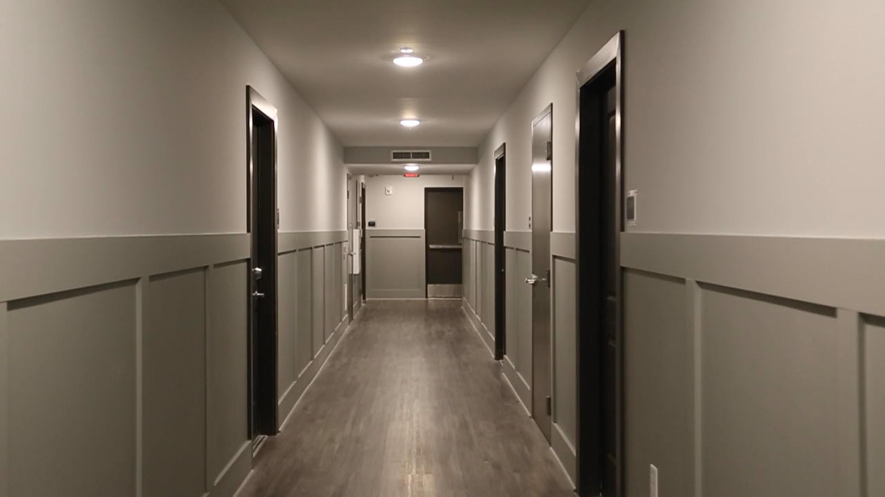

# Project 2: Video Stabilization

## Synopsis

For this project I replicated results of the video stabilization method in paper:

- Matthias Grundman, Vivek Kwatra, Irfan Essa. [Auto-Directed Video Stabilization with Robust L1 Optimal Camera Paths](https://www.cc.gatech.edu/cpl/projects/videostabilization/). (2011)

Pipeline of producing stabilized video:

## Running instructions

Set up the environment with the `environment.yml` file. Then at the same level of `main.py` and `final_project.py`, make sure there is a folder named `videos`.
Inside this `videos` folder, make sure there is a folder named `source`.
Then put all input videos you want to process into this `source` folder and run `main.py`

## Results

https://youtube.com/playlist?list=PLFip_pImbmCXXI86XuvYQd_6DrJ_W3xkc

### Result of skater video

input video | output video with red box | output video
|---|---|---|
https://youtu.be/JMxYdKNEvHg | https://youtu.be/GnXsH-jAsBQ | https://youtu.be/0xOpHQYftkE

example of input frame with optimal crop window | example frame of output frame
|---|---|
 | 

transform in x | transform in y
|---|---|
 | 

- This input video is a skater video. Some parts has bad stabilization results because the background is mostly ice, so the algorithm cannot find feature points in the background. Then the tracking of camera movement is inaccurate.

Example of tracking background failure:

- The red dots are features my algorithm find. When the background is plain, in this situation is large area of white. The algorithm cannot find features in the background. It will find corners on the skater. It will cause shaking because the skater is moving fast. I think I should try foreground removal methods to solve this problem.

### Result of original video 1

input video | output video with red box | output video
|---|---|---|
https://youtu.be/hDOoeOVxIfo | https://youtu.be/W7-KzCKfpEg | https://youtu.be/CISVBwPpTj0

example of input frame with optimal crop window | example frame of output frame
|---|---|
 | 

transform in x | transform in y
|---|---|
 | 

### Result of original video 2

input video | output video with red box | output video
|---|---|---|
https://youtu.be/qge43-C3xPA | https://youtu.be/RS32PKwYKBU | https://youtu.be/2GU6tPfb0SY

example of input frame with optimal crop window | example frame of output frame
|---|---|
 | 

transform in x | transform in y
|---|---|
 | 

Result of original video 3

input video | output video with red box | output video
|---|---|---|
https://youtu.be/ITlvruoNC5o | https://youtu.be/9VL5riuZ384 | https://youtu.be/kHSDDVYXIqQ

transform in x | transform in y
|---|---|
 | 
